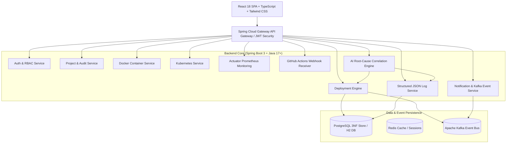

# OpsPilot — AI-Assisted Internal Developer Platform (IDP)

OpsPilot is an enterprise-grade Internal Developer Platform (IDP) designed to unify project management, continuous deployment, Docker container orchestrations, Kubernetes cluster monitoring, Actuator system metrics, structured JSON logging, Kafka event notifications, GitHub Actions webhooks, and AI-assisted root-cause diagnosis into a single cohesive, high-performance web dashboard.

---

## 🏗️ System Architecture



---

## 🗄️ Relational 3NF Database Schema Overview

OpsPilot enforces strict Third Normal Form (3NF) relational integrity across all platform entities:

- **`Users`**: `(user_id PK, name, email UNIQUE, password_hash, created_at)`
- **`Roles`**: `(role_id PK, role_name UNIQUE)` — Pre-seeded roles: `Admin`, `Developer`, `DevOps`
- **`User_Roles`**: `(user_id FK, role_id FK)`
- **`Projects`**: `(project_id PK, project_name, description, repository_url, owner_id FK->Users, status, created_at)`
- **`Deployments`**: `(deployment_id PK, project_id FK->Projects, deployed_by FK->Users, version, environment, status, deployed_at)`
- **`Containers`**: `(container_id PK, deployment_id FK->Deployments, image_name, container_status, created_at)`
- **`Pods`**: `(pod_id PK, container_id FK->Containers, node_name, pod_status, cpu_usage, memory_usage)`
- **`Logs`**: `(log_id PK, deployment_id FK->Deployments NULLABLE, source_service, log_level, message, timestamp)`
- **`Notifications`**: `(notification_id PK, user_id FK->Users NULLABLE, deployment_id FK->Deployments NULLABLE, message, type, is_read, created_at)`
- **`Pipeline_Runs`**: `(run_id PK, project_id FK->Projects, event_type, branch, commit_sha, commit_message, author, status, created_at)`
- **`Audit_Logs`**: `(audit_id PK, user_id FK->Users, action, details, timestamp)`

---

## 📡 REST API Reference

### Authentication & RBAC
| Method | Endpoint | Access | Description |
|---|---|---|---|
| `POST` | `/api/auth/register` | Public | Register a new user (`Admin`, `Developer`, `DevOps`) |
| `POST` | `/api/auth/login` | Public | Authenticate user and issue JWT token |

### Project Management
| Method | Endpoint | Access | Description |
|---|---|---|---|
| `GET` | `/api/projects` | Authenticated | List all projects |
| `GET` | `/api/projects/{id}` | Authenticated | Get project details |
| `POST` | `/api/projects` | Admin, Developer | Create a new microservice project |
| `PUT` | `/api/projects/{id}` | Project Owner / Admin | Update project details |
| `DELETE` | `/api/projects/{id}` | Project Owner / Admin | Delete project |

### Deployment Engine
| Method | Endpoint | Access | Description |
|---|---|---|---|
| `GET` | `/api/projects/{id}/deployments` | Authenticated | Get deployment history for a project |
| `POST` | `/api/projects/{id}/deployments` | Admin, Developer | Trigger a deployment pipeline |

### Infrastructure Management
| Method | Endpoint | Access | Description |
|---|---|---|---|
| `GET` | `/api/docker/containers` | Authenticated | List active Docker containers |
| `POST` | `/api/docker/containers/{id}/start` | DevOps, Admin | Start a Docker container |
| `POST` | `/api/docker/containers/{id}/stop` | DevOps, Admin | Stop a Docker container |
| `POST` | `/api/docker/containers/{id}/restart` | DevOps, Admin | Restart a Docker container |
| `GET` | `/api/kubernetes/pods` | Authenticated | List Minikube / K8s pods |

### Monitoring, Logs & Notifications
| Method | Endpoint | Access | Description |
|---|---|---|---|
| `GET` | `/api/monitoring/metrics` | Authenticated | Get Actuator CPU, memory & HTTP metrics |
| `GET` | `/api/logs` | Authenticated | Search structured JSON logs by service/level/query |
| `POST` | `/api/logs` | Authenticated | Ingest custom log entries |
| `GET` | `/api/notifications` | Authenticated | Get Kafka deployment event notifications |
| `PUT` | `/api/notifications/{id}/read` | Authenticated | Mark notification as read |

### CI/CD & AI Assistant
| Method | Endpoint | Access | Description |
|---|---|---|---|
| `POST` | `/api/webhooks/github` | Public | Webhook listener for GitHub Actions push/workflow events |
| `GET` | `/api/cicd/runs` | Authenticated | Fetch GitHub Actions pipeline runs |
| `POST` | `/api/ai/query` | Authenticated | Run timestamp-correlation AI root cause diagnosis |

---

## 🎨 Locked Dark Theme Design System

OpsPilot strictly implements a high-contrast dark theme optimized for DevOps operations:

| Token Name | Hex Code | Usage |
|---|---|---|
| Main Background | `#060B18` | Application background |
| Card Background | `#0F1B2E` | Component cards and panels |
| Panel Secondary | `#13233B` | Input fields, dropdowns, and table headers |
| Borders | `#1E2D45` | Card and divider borders |
| Primary Accent | `#38BDF8` | Buttons, links, primary indicators (Cyan) |
| AI Accent | `#A78BFA` | AI Assistant badges, cards, and highlights (Violet) |
| Warning Accent | `#F59E0B` | Warning badges and alerts (Amber) |
| Primary Text | `#F8FAFC` | Headings, labels, and table content |
| Muted Text | `#94A3B8` | Subtitles, metadata, and placeholder text |

---

## 🚀 Quickstart Run Instructions

### Prerequisites
- Java 17+ / Java 26
- Maven 3.9+ (`./mvnw`)
- Node.js 18+ & npm

### 1. Run Spring Boot Backend
```bash
cd backend
./mvnw spring-boot:run -Dspring-boot.run.profiles=h2
```
The backend server runs on `http://localhost:8080`.

### 2. Run React Frontend
```bash
cd frontend
npm install
npm run dev
```
The frontend application will be accessible at `http://localhost:5173`.

---

## 🧪 Test Suite Execution

- **Backend Unit Tests**:
  ```bash
  cd backend && ./mvnw test
  ```
- **Frontend Typecheck & Production Build**:
  ```bash
  cd frontend && npm run build
  ```
