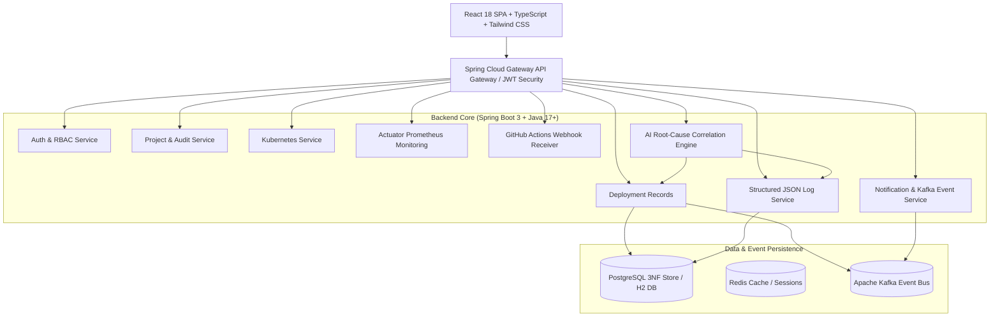

# OpsPilot — AI-Assisted Internal Developer Platform (IDP)

OpsPilot is an enterprise-grade Internal Developer Platform (IDP) designed to unify project management, continuous deployment, Docker container orchestrations, Kubernetes cluster monitoring, Actuator system metrics, structured JSON logging, Kafka event notifications, GitHub Actions webhooks, and AI-assisted root-cause diagnosis into a single cohesive, high-performance web dashboard.

---

## 🏗️ System Architecture


```mermaid
graph TD
    Client[React 18 SPA + TypeScript + Tailwind CSS]
    Gateway[Spring Cloud Gateway API Gateway / JWT Security]
    
    subgraph "Backend Core (Spring Boot 3 + Java 17+)"
        AuthService[Auth & RBAC Service]
        ProjService[Project & Audit Service]
        DeployService[Deployment Records]
        K8sService[Kubernetes Service]
        LogService[Structured JSON Log Service]
        NotifService[Notification & Kafka Event Service]
        MonitorService[Actuator Prometheus Monitoring]
        CiCdService[GitHub Actions Webhook Receiver]
        AiService[AI Root-Cause Correlation Engine]
    end

    subgraph "Data & Event Persistence"
        PostgreSQL[(PostgreSQL 3NF Store / H2 DB)]
        Redis[(Redis Cache / Sessions)]
        Kafka[(Apache Kafka Event Bus)]
    end

    Client --> Gateway
    Gateway --> AuthService
    Gateway --> ProjService
    Gateway --> DeployService
    Gateway --> K8sService
    Gateway --> LogService
    Gateway --> NotifService
    Gateway --> MonitorService
    Gateway --> CiCdService
    Gateway --> AiService

    DeployService --> PostgreSQL
    DeployService --> Kafka
    NotifService --> Kafka
    LogService --> PostgreSQL
    AiService --> LogService
    AiService --> DeployService
```

---

## 🗄️ Relational 3NF Database Schema Overview

OpsPilot enforces strict Third Normal Form (3NF) relational integrity across all platform entities:

- **`Users`**: `(user_id PK, name, email UNIQUE, password_hash, created_at)`
- **`Roles`**: `(role_id PK, role_name UNIQUE)` — Pre-seeded roles: `Admin`, `Developer`, `DevOps`
- **`User_Roles`**: `(user_id FK, role_id FK)`
- **`Projects`**: `(project_id PK, project_name, description, repository_url, owner_id FK->Users, status, created_at)`
- **`Deployments`**: `(deployment_id PK, project_id FK->Projects, deployed_by FK->Users, version, environment, status, deployed_at)`
- **`Containers`**: `(container_id PK, deployment_id FK->Deployments, image_name, container_status, created_at)`
- **`Pods`**: `(pod_id PK, container_id FK->Containers, node_name, pod_status, cpu_usage, memory_usage)`
- **`Logs`**: `(log_id PK, deployment_id FK->Deployments NULLABLE, source_service, log_level, message, timestamp)`
- **`Notifications`**: `(notification_id PK, user_id FK->Users NULLABLE, deployment_id FK->Deployments NULLABLE, message, type, is_read, created_at)`
- **`Pipeline_Runs`**: `(run_id PK, project_id FK->Projects, event_type, branch, commit_sha, commit_message, author, status, created_at)`
- **`Audit_Logs`**: `(audit_id PK, user_id FK->Users, action, details, timestamp)`

---

## 📡 REST API Reference

### Email verification configuration

New registrations require email verification before login. Configure these environment variables for the auth service; never commit SMTP credentials:

```text
MAIL_HOST=smtp.example.com
MAIL_PORT=587
MAIL_USERNAME=your-smtp-user
MAIL_PASSWORD=your-smtp-password
MAIL_FROM=no-reply@example.com
MAIL_AUTH=true
MAIL_STARTTLS=true
OTP_EXPIRATION_MINUTES=5
OTP_MAX_ATTEMPTS=5
OTP_RESEND_COOLDOWN_SECONDS=60
```

The signup flow is `POST /api/auth/register`, `POST /api/auth/verify-otp`, then normal `POST /api/auth/login`. Existing users are treated as verified by the migration default.

### Authentication & RBAC
| Method | Endpoint | Access | Description |
|---|---|---|---|
| `POST` | `/api/auth/register` | Public | Register a new user (`Admin`, `Developer`, `DevOps`) |
| `POST` | `/api/auth/verify-otp` | Public | Verify 6-digit registration OTP code |
| `POST` | `/api/auth/resend-otp` | Public | Resend verification OTP code (with rate limit cooldown) |
| `POST` | `/api/auth/login` | Public | Authenticate user and issue JWT token |
| `POST` | `/api/auth/google` | Public | Authenticate or complete registration with Google OAuth |

### Project Management & Workspace Scoping
| Method | Endpoint | Access | Description |
|---|---|---|---|
| `GET` | `/api/projects` | Authenticated | List all projects owned by the authenticated user |
| `GET` | `/api/projects/{id}` | Authenticated | Get project details (Owner or Platform Admin) |
| `POST` | `/api/projects` | Admin, Developer | Create a new project (auto-assigned to caller as owner) |
| `PUT` | `/api/projects/{id}` | Project Owner / Admin | Update project details |
| `DELETE` | `/api/projects/{id}` | Project Owner / Admin | Delete project and linked metadata |

### Platform Administration & Governance
| Method | Endpoint | Access | Description |
|---|---|---|---|
| `GET` | `/api/v1/admin/overview` | Admin | Platform overview, user distribution, and system vitals |
| `GET` | `/api/v1/admin/projects` | Admin | Cross-workspace project registry for containment and review |
| `GET` | `/api/v1/admin/audit-logs` | Admin | Centralized audit trail across all platform actions |
| `GET` | `/api/v1/admin/integrations` | Admin | Platform-wide infrastructure integrations |
| `POST` | `/api/v1/admin/integrations` | Admin | Configure and test platform integrations |
| `GET` | `/api/v1/admin/settings` | Admin | View platform governance and rate limiting settings |
| `PUT` | `/api/v1/admin/settings` | Admin | Update platform governance settings |
| `GET` | `/api/v1/admin/security/stats` | Admin | Security posture, quarantine counts, and error summaries |

### Deployments
OpsPilot records deployments; it does not run them (see *Deployments* below for the three sources).

| Method | Endpoint | Access | Description |
|---|---|---|---|
| `GET` | `/api/projects/{id}/deployments` | Project owner, DevOps, Admin | Deployment history for a project |
| `POST` | `/api/projects/{id}/deployments` | Project owner, DevOps, Admin | Record a deployment (`version`, `environment`, optional `status`, `url`) |
| `POST` | `/api/v1/ingest/{projectId}/deployments` | Bearer ingest token | A CI pipeline reports a deployment |
| `GET` | `/api/deployments/{id}/logs` | Project owner, DevOps, Admin | The project's logs around the deployment |

### Infrastructure Management
| Method | Endpoint | Access | Description |
|---|---|---|---|
| `GET` | `/api/kubernetes/pods` | Authenticated | List Minikube / K8s pods |

### Monitoring, Logs & Notifications
| Method | Endpoint | Access | Description |
|---|---|---|---|
| `GET` | `/api/monitoring/metrics` | Authenticated | Get Actuator CPU, memory & HTTP metrics |
| `GET` | `/api/logs` | Authenticated | Search structured JSON logs by service/level/query |
| `POST` | `/api/logs` | Authenticated | Ingest custom log entries |
| `GET` | `/api/notifications` | Authenticated | Get Kafka deployment event notifications |
| `PUT` | `/api/notifications/{id}/read` | Authenticated | Mark notification as read |

### CI/CD & AI Assistant
| Method | Endpoint | Access | Description |
|---|---|---|---|
| `POST` | `/api/webhooks/github` | Public | Webhook listener for GitHub Actions push/workflow events |
| `GET` | `/api/cicd/runs` | Authenticated | Fetch GitHub Actions pipeline runs |
| `POST` | `/api/ai/query` | Authenticated | Run timestamp-correlation AI root cause diagnosis |

---

## 🧭 Project-first flow: connect, then watch

Everything starts with a **project**. Inside it you connect the systems you care about and watch all their logs in one live dashboard.

1. **Create a project** (`/projects` → *Create Project*): name, environment (`dev` / `staging` / `prod`), optional repository.
2. **Connect integrations** (`/projects/:id/integrations`): each card has *Connect*, *Configure*, *Test* and *Disconnect*.
3. **Watch logs**: `/projects/:id/logs` is one stream for every source (filters: source, level, time range, text; pause/resume, auto-scroll, source badges, colour-coded levels). `/projects/:id/logs/:integrationId` is a dedicated page per integration.

The project switcher in the sidebar keeps the selection. Existing global pages (`/logs`, `/pipelines`, `/deployments`, `/incidents`, `/github`) follow the selected project, and a banner offers *Show all projects*. On a new database, migration `V15` moves data created before this flow into a **Default Project**; databases created before Flyway was enabled skip it (see *Database schema* below).

**Multi-Tenant Isolation & Admin Governance**:
- **Tenant Scope**: Project lists, live logs, Docker log sources, and metrics are strictly bounded to the projects owned by the authenticated developer.
- **Session Hygiene**: When a user logs out, active project selection cache in local storage (`opspilot_selected_project_id`) is purged, and query cache keys are partitioned by `user.id` to prevent cross-account leakage.
- **Administrative Governance**: Platform administrators review, quarantine, or delete workloads across all developer workspaces via the dedicated `/admin/projects` portal powered by `GET /api/v1/admin/projects`.

### Integrations

| Type | Reads from | Settings (secrets in *italics*) | Notes |
|---|---|---|---|
| **Docker** | Docker Engine API over TCP | `host`, `containers`, *`caCert`* | Container picker on its page. Unix sockets are not supported; expose the API over TCP or a socket proxy. |
| **Kubernetes** | Kubernetes API | `apiServer`, `namespace`, `podName`, `labelSelector`, `container`, *`token`*, *`caCert`* | Uses the in-cluster service account when no `apiServer` is set. Needs `get/list pods` and `get pods/log`. Kubeconfig files are not parsed; use a service-account token. |
| **Git** (`GITHUB`) | GitHub REST API + webhooks | `repo`, `apiBaseUrl`, `pollSeconds`, *`token`*, *`webhookSecret`* | Pushes, pull requests, workflow runs as a timeline; `deployment` / `deployment_status` events become the project's deployments. GitLab is not implemented. |
| **CI/CD** | GitHub Actions or Jenkins | GitHub: `repo`, *`token`*. Jenkins: `baseUrl`, `job`, *`username`*, *`apiToken`* | Run list; opening a run reads its jobs/steps (GitHub) or console (Jenkins). The Jenkins live stream reports build state changes. |
| **App Logs** | Pushed by your app | `app` | An ingest token is shown **once** at creation. |

Secrets are split from settings by the server, encrypted at rest (AES-256-GCM), never returned by any API, and masked in error messages and log lines. Editing an integration keeps stored secrets unless you send new ones.

### Deployments

A deployment record comes from one of three places; OpsPilot never deploys anything itself.

1. **GitHub** (automatic): add a Git integration with a `webhookSecret`, and in the repository's webhook settings subscribe to *Deployments* and *Deployment statuses*. Deploying to a GitHub environment (for example from an Actions job with `environment: production`) then records the deployment, follows its status, and keeps the environment URL.
2. **Any CI system**: report it with an App Logs integration's ingest token. Send the same `id` again to update the status.
   ```bash
   curl -X POST "$API/api/v1/ingest/{projectId}/deployments"      -H "Authorization: Bearer opl_..." -H "Content-Type: application/json"      -d '{"id":"build-512","version":"v2.8.4","environment":"production","status":"success","url":"https://app.example.com"}'
   ```
   `status`: `in_progress`, `success`, `failure` or `inactive` (default `success`).
3. **By hand**: *Projects → Deployments → Record deployment*, or `POST /api/v1/projects/{id}/deployments` with a user token.

A deployment's logs are the project's logs from five minutes before it to fifteen minutes after its last status update. Deployments created by the simulator in earlier versions are labelled *Simulated (legacy)*; `scripts/db/delete_simulated_deployments.sql` removes them.

### Sending application logs

```bash
curl -X POST "$API/api/v1/ingest/{projectId}" \
  -H "Authorization: Bearer opl_..." -H "Content-Type: application/json" \
  -d '[{"level":"ERROR","message":"payment failed","order_id":"A-1042"}]'
```

Accepts a JSON object, an array, `{"logs":[...]}`, NDJSON, or plain text (one entry per line); up to 1,000 entries and `INGEST_MAX_BODY_BYTES` per request. `message`, `level` and `timestamp` (ISO-8601 or epoch seconds/ms) are understood; other simple fields become searchable metadata. The integration page shows a ready-made Django logging handler.

GitHub webhooks (optional, for instant Git events): payload URL `/api/v1/ingest/{projectId}/github/{integrationId}`, content type JSON, secret = the integration's `webhookSecret`. Deliveries are verified with `X-Hub-Signature-256`.

### Project, integration and log API

All paths also exist under `/api/projects/...` (without `v1`).

| Method | Endpoint | Description |
|---|---|---|
| `POST` `GET` `PUT` `DELETE` | `/api/v1/projects[/{id}]` | Project CRUD (`name`, `description`, `environment`, `repositoryUrl`; `slug` is generated) |
| `GET` `POST` | `/api/v1/projects/{id}/integrations` | List / create (`provider`, `name`, `category`, `config{}`, `secrets{}`) |
| `GET` `PUT` `DELETE` | `/api/v1/projects/{id}/integrations/{iid}` | Read / update / delete |
| `POST` | `.../integrations/{iid}/test` | Run the connection test; returns the integration with `status` and `statusMessage` |
| `POST` | `.../integrations/{iid}/disconnect` | Stop collecting |
| `GET` | `.../integrations/{iid}/resources?kind=containers\|namespaces\|pods` | Pickers |
| `GET` | `.../integrations/{iid}/history?...` | Read straight from the source (selectors: `container`, `namespace`, `pod`, `run`, `build`) |
| `GET` | `/api/v1/projects/{id}/logs?integrationId&type&level&from&to&q&container&namespace&pod&page&size` | Stored logs, newest first |
| `GET` | `/api/v1/projects/{id}/logs/stream?...` | Server-sent events with the same filters; 15 s keepalive; honours `Last-Event-ID` to replay what was missed |
| `POST` | `/api/v1/ingest/{projectId}` | Push logs (Bearer ingest token) |
| `POST` | `/api/v1/ingest/{projectId}/deployments` | Report a deployment from CI (Bearer ingest token) |

### How it fits together

- **core-service** owns projects and integrations, the `IntegrationConnector` implementations' *test / discover / history* calls, and encrypted credentials.
- **observability-service** owns the log store: it runs a `ConnectorRunner` that follows every `CONNECTED` pull integration (reconnecting with backoff), accepts pushes, serves the query and SSE endpoints, and fans new lines out to live viewers.
- Connectors implement `IntegrationConnector` (`testConnection`, `streamLogs`, `fetchHistory`) in `shared-lib`, so a new source type is one class plus a form definition in `frontend/src/lib/integrationTypes.ts`.
- The browser reads the stream with `fetch` (not `EventSource`, which cannot send the `Authorization` header), reconnects automatically, and resumes from the last event id. At most 5,000 lines are kept in memory and the list is virtualized.

### Configuration

| Variable | Service | Default | Purpose |
|---|---|---|---|
| `JWT_SECRET` | auth, core, observability, log-watcher | **required** | Signs login tokens; must be identical in every service and at least 32 bytes. `openssl rand -base64 48`. Changing it signs everyone out |
| `DEMO_USERS_ENABLED` | auth, core, observability | `false` | Creates the public demo accounts (`admin@opspilot.io` / `Password123!` etc.). Local development only |
| `AUTH_COOKIE_SECURE` | auth | `true` | Send the refresh cookie over HTTPS only; `false` for plain-HTTP local development |
| `GITHUB_WEBHOOK_SECRET` | core, observability | empty | Secret for the global GitHub webhook URLs. Empty = those URLs refuse every delivery; per-project and per-source webhook URLs use their own secrets |
| `JENKINS_WEBHOOK_SECRET` | core | empty | Token for the global Jenkins webhook URL; empty = refused |
| `OPSPILOT_ENCRYPTION_KEY` | auth, core, observability | **required** | Key for stored credentials (AES-256-GCM). Services refuse to start without it; changing it makes stored secrets unreadable. Values written before it was required are re-encrypted under it on core-service's next start. `openssl rand -base64 32` |
| `LOGS_RUNNER_ENABLED` | observability | `true` | Follow pull integrations (set `false` on replicas that should only serve reads) |
| `LOGS_RUNNER_INTERVAL_MS` | observability | `30000` | How often to look for new / changed / disconnected integrations |
| `LOGS_RUNNER_REFRESH` | observability | `10m` | Re-resolve containers and pods for Docker / Kubernetes streams |
| `INGEST_MAX_BODY_BYTES` | observability | `5242880` | Largest accepted push body |
| `MAIL_HOST` | auth | empty | SMTP hostname for registration verification emails |
| `MAIL_PORT` | auth | `587` | SMTP server port |
| `MAIL_USERNAME` | auth | empty | SMTP authentication username |
| `MAIL_PASSWORD` | auth | empty | SMTP authentication password |
| `MAIL_FROM` | auth | `no-reply@opspilot.io` | Sender email address for OTP delivery |
| `OTP_EXPIRATION_MINUTES` | auth | `5` | Validity duration of verification OTP |
| `OTP_MAX_ATTEMPTS` | auth | `5` | Maximum failed attempts allowed before code invalidation |
| `OTP_RESEND_COOLDOWN_SECONDS` | auth | `60` | Cooldown in seconds before resending an OTP |
| `VITE_API_BASE_URL` | frontend | `http://localhost:8080/api/v1` | API gateway URL |
| `VITE_GOOGLE_CLIENT_ID` | frontend | optional | Google OAuth 2.0 Client ID for social registration/login |

Integration endpoints are fetched by the server, so only point them at hosts you trust; `http(s)` only, and link-local addresses (cloud metadata) are refused.

### Database schema

Flyway owns the schema (`backend/shared-lib/src/main/resources/db/migration`) and Hibernate only validates it (`ddl-auto: validate`), so a service refuses to start if its entities and the database disagree. Change the schema by adding a new `V<n>__description.sql`; never edit one that has shipped.

Flyway was not actually on the classpath before `V18`, so databases created earlier were built by Hibernate and have no `flyway_schema_history`. On first start they are baselined at version 17 and `V18` brings them in line; empty databases run every migration from `V1`. auth, core and observability all run Flyway, and its PostgreSQL lock lets them start at the same time.

---

## 🎨 Locked Dark Theme Design System

OpsPilot strictly implements a high-contrast dark theme optimized for DevOps operations:

| Token Name | Hex Code | Usage |
|---|---|---|
| Main Background | `#060B18` | Application background |
| Card Background | `#0F1B2E` | Component cards and panels |
| Panel Secondary | `#13233B` | Input fields, dropdowns, and table headers |
| Borders | `#1E2D45` | Card and divider borders |
| Primary Accent | `#38BDF8` | Buttons, links, primary indicators (Cyan) |
| AI Accent | `#A78BFA` | AI Assistant badges, cards, and highlights (Violet) |
| Warning Accent | `#F59E0B` | Warning badges and alerts (Amber) |
| Primary Text | `#F8FAFC` | Headings, labels, and table content |
| Muted Text | `#94A3B8` | Subtitles, metadata, and placeholder text |

---

## 🚀 Quickstart Run Instructions

### Prerequisites
- Java 17+ / Java 26
- Maven 3.9+ (`./mvnw`)
- Node.js 18+ & npm

### 1. Run Spring Boot Backend
```bash
cd backend
./mvnw spring-boot:run -Dspring-boot.run.profiles=h2
```
The backend server runs on `http://localhost:8080`.

### 2. Run React Frontend
```bash
cd frontend
npm install
npm run dev
```
The frontend application will be accessible at `http://localhost:5173`.

---

## 🧪 Test Suite Execution

### Running Locally
- **Backend Unit Tests**:
  ```bash
  cd backend && ./mvnw test
  ```
- **Frontend Typecheck & Production Build**:
  ```bash
  cd frontend && npm run build
  ```
- **Frontend Unit & Integration Tests** (9 suites, 92 tests covering authentication validation, virtualized logs, SSE parser, deployments dialog, and project forms):
  ```bash
  cd frontend && npm test
  ```

### Running in Docker
- **Backend Build & Verification**:
  ```bash
  docker run --rm -v opspilot-m2-cache:/root/.m2 -v "${PWD}/backend:/app" -w /app maven:3.9-eclipse-temurin-17 mvn test-compile
  ```
- **Frontend Container Build**:
  ```bash
  docker build -t opspilot-frontend:latest ./frontend
  ```
